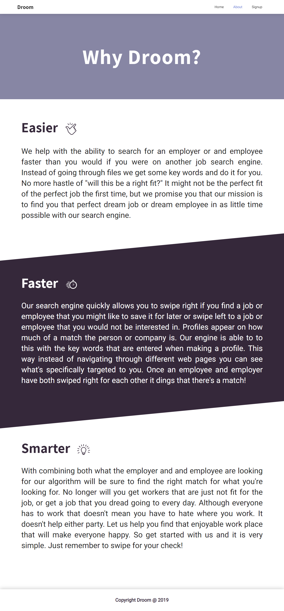

# Droom Marketing Page
### [droom-marketing.netlify.com](https://droom-marketing.netlify.com/)

- [Droom Product Vision (PVD)](https://docs.google.com/document/d/1bsorUpw2ouQi56Zl-gvDdWeeLAQfQX9skcXsw2bv6KU/edit#heading=h.8k66cyet0u4q)

## What is it?
This git repository holds the source code for the Droom marketing page. This includes 2 main pages; landing page (`index.html`) and an about page (`about.html`). These pages were made with the help of HTML, CSS, LESS (CSS precompiler) and JavaScript.

## Technology
- HTML5
- CSS3
- JavaScript

## Team
- [Christian Berumen](https://github.com/Cberumen51)
- [Harry Merritt](https://github.com/hmerritt)
- [John Noory](https://github.com/johnnoory256)

## Links
- [Github](https://github.com/BW-Droom/marketing_page)
- [Deployed Site](https://droom-marketing.netlify.com/)

## Support
If you have any questions or want to contribute to this repo, feel free to contact any of the aforementioned team members.

## Images
### Home

### About
